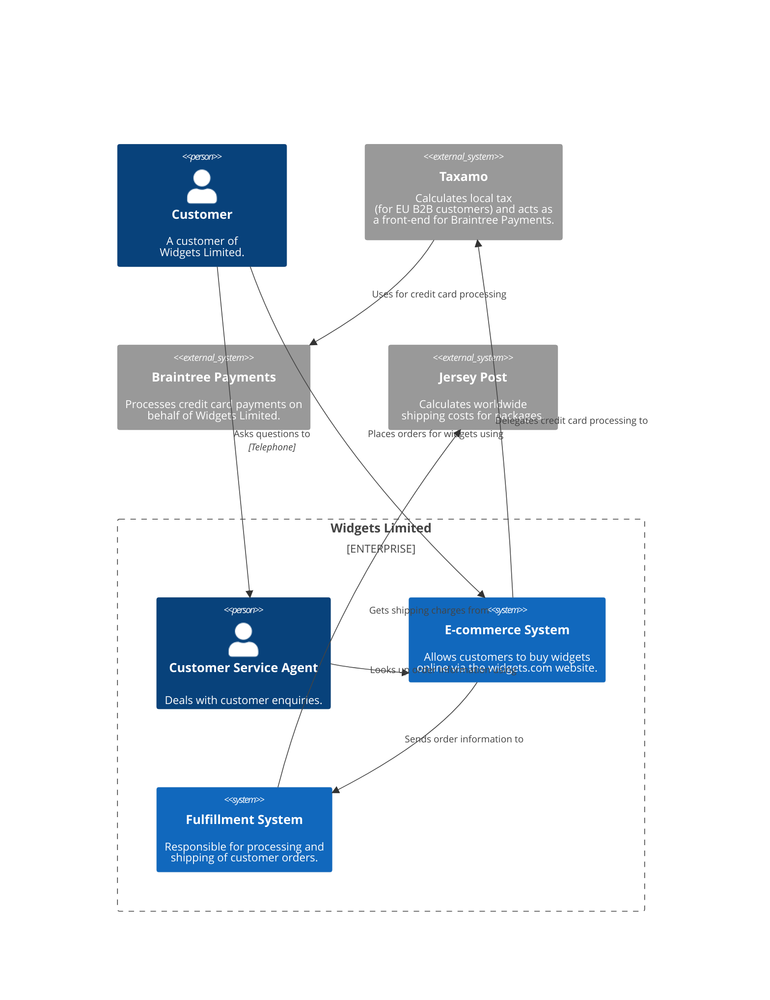

# Why diagram?

As an industry, we do have the Unified Modeling Language (UML), ArchiMate and SysML, but asking whether these provide an 
effective way to communicate software architecture is often irrelevant because many teams have already thrown them out 
in favour of much simpler "boxes and lines" diagrams. Abandoning these modelling languages is one thing but, perhaps in 
the race for agility, many software development teams have lost the ability to communicate visually.

# Different Diagrams for Different Audiences

## System Context Diagram

!!! info "System Context Diagram Details"

    **Scope**: A single software system.
    
    **Primary elements**: The software system in scope.
    
    **Supporting elements**: People (e.g. users, actors, roles, or personas) and software systems (external 
    dependencies) that are directly connected to the software system in scope. Typically these other software systems 
    sit outside the scope or boundary of your own software system, and you don't have responsibility or ownership of 
    them.
    
    **Intended audience**: Everybody, both technical and non-technical people, inside and outside of the software 
    development team.
    
    **Recommended for most teams**: Yes.
