# Kitchen Sink

## Abbreviations

This template comes with a lot of built-in abbreviations. To use them just type an abbreviation, and it will be
annotated.

* WCAG
* WIFI
* W3C

!!! warning "Only in production!"

    The abbreviations will only render when you run `make build`, they do not show with `make dev`.

## Diagrams

### Flowchart

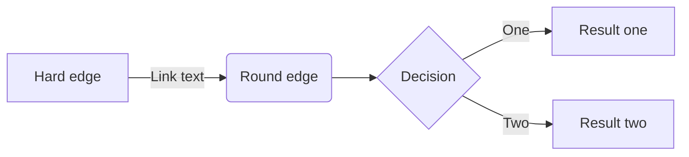

### Sequence Diagram

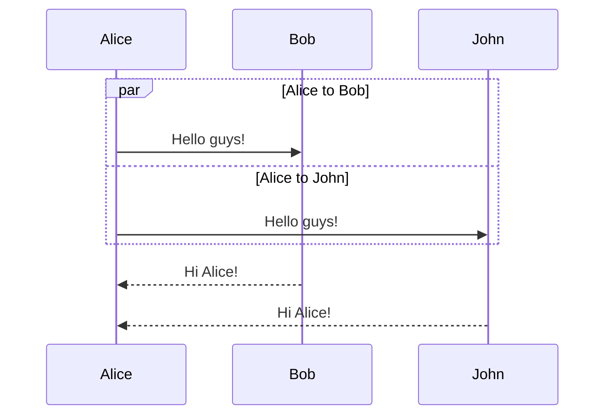

### Class Diagram

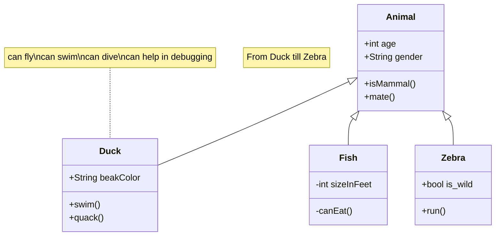

### State Diagram

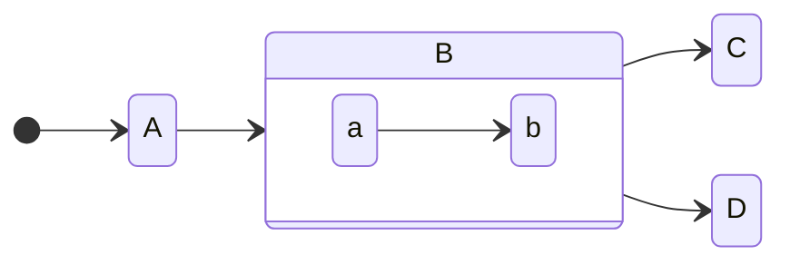

### Entity Relationship

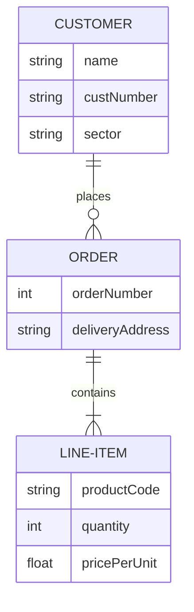

### User Journey

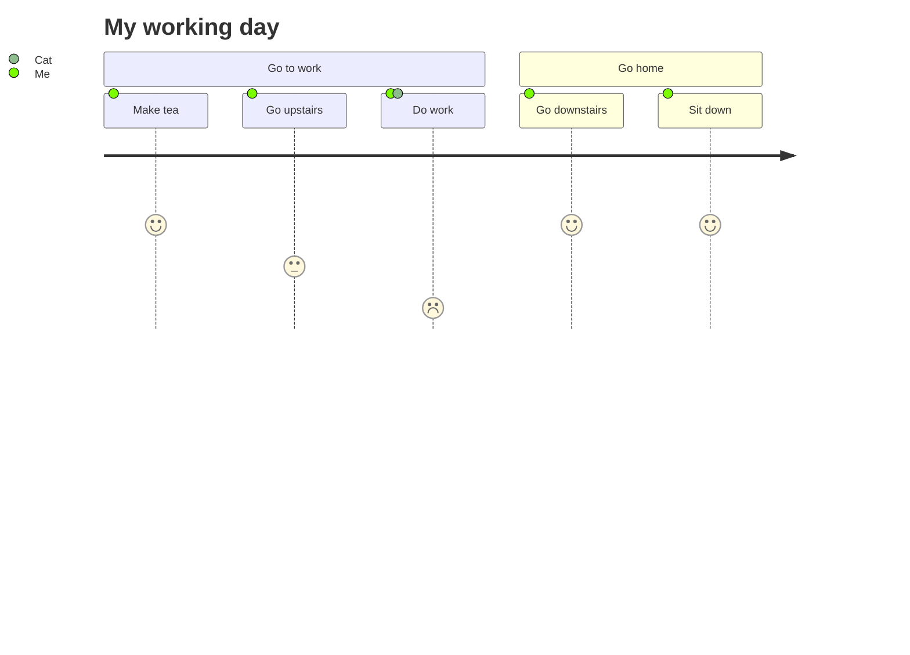

### Gantt

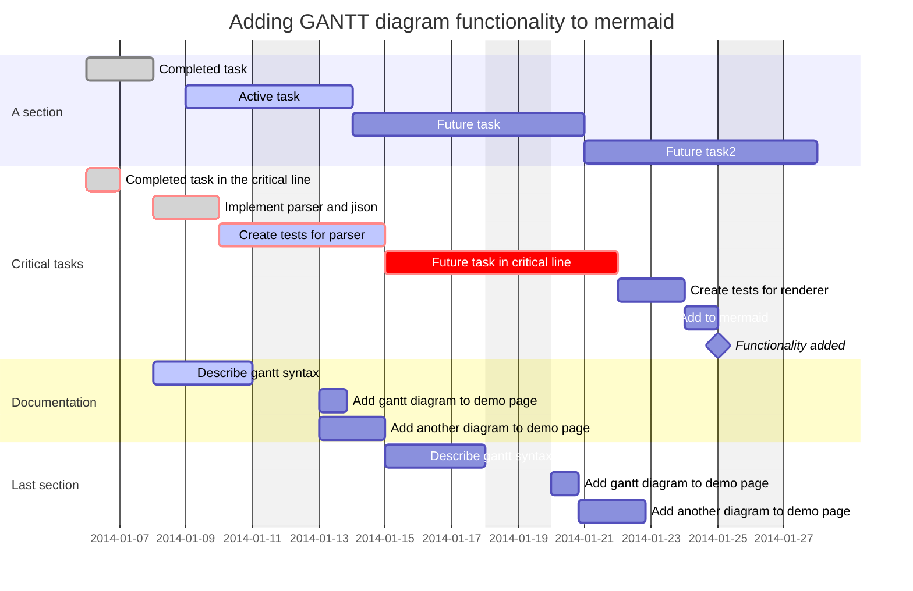

### Pie Chart

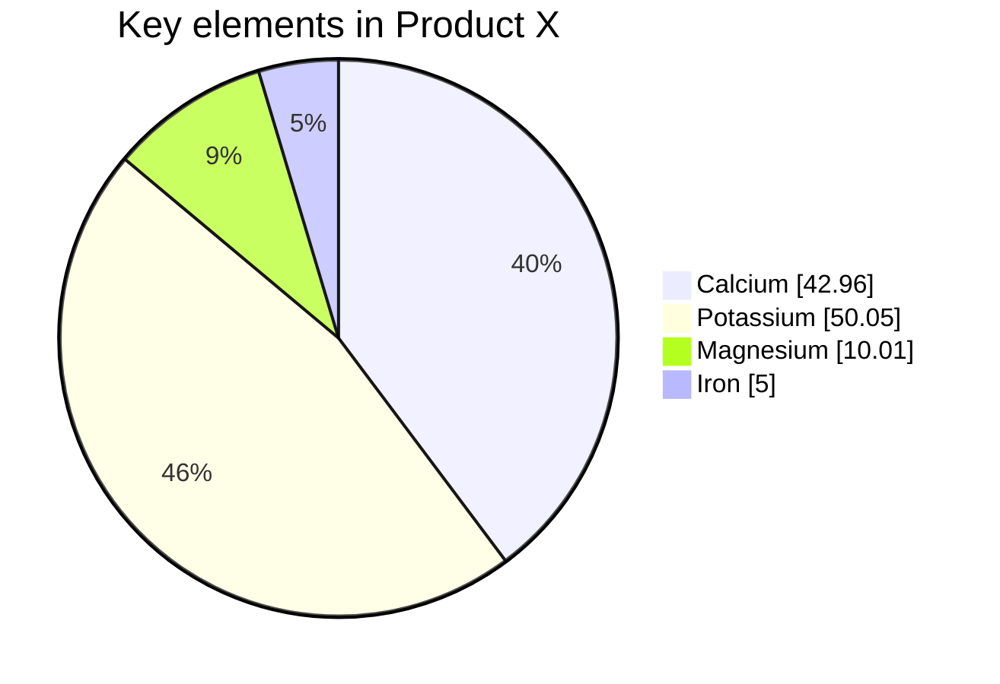

### Requirement

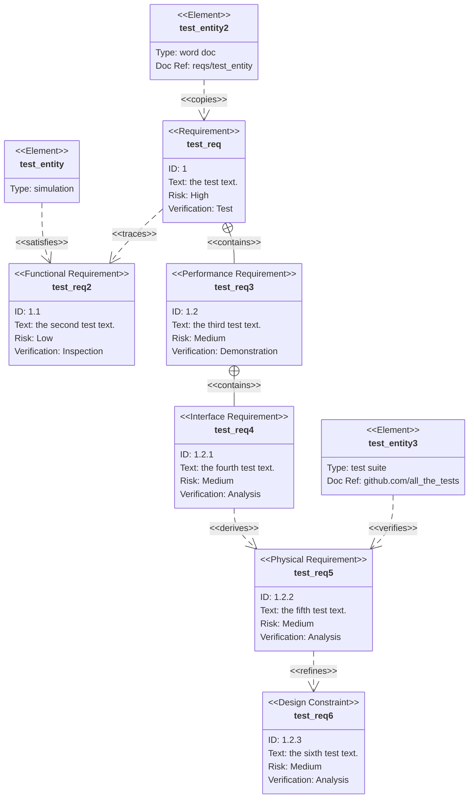

### Git Graph

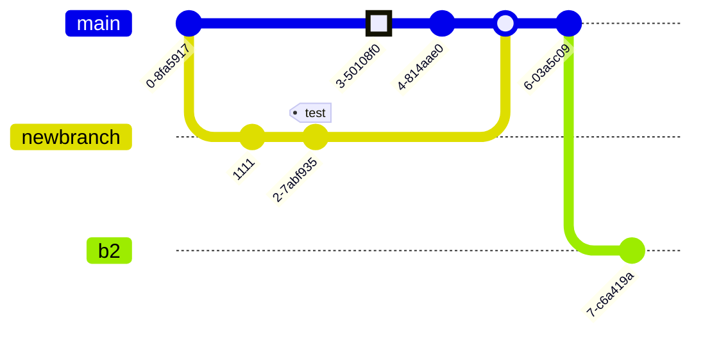

### C4 Diagram

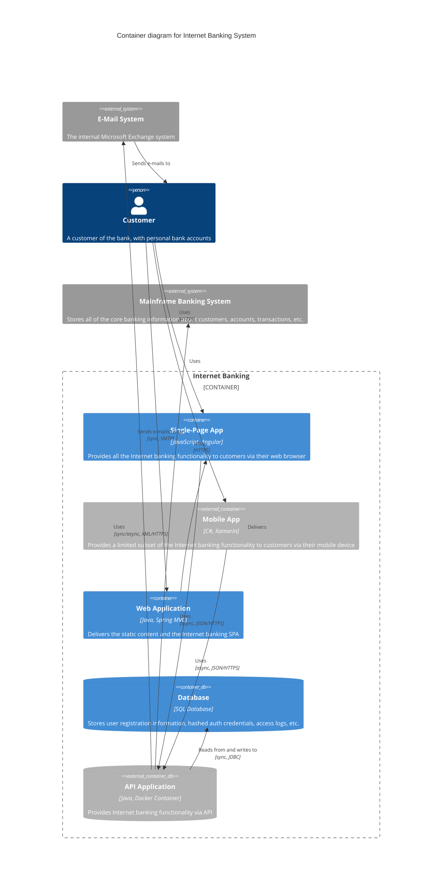
